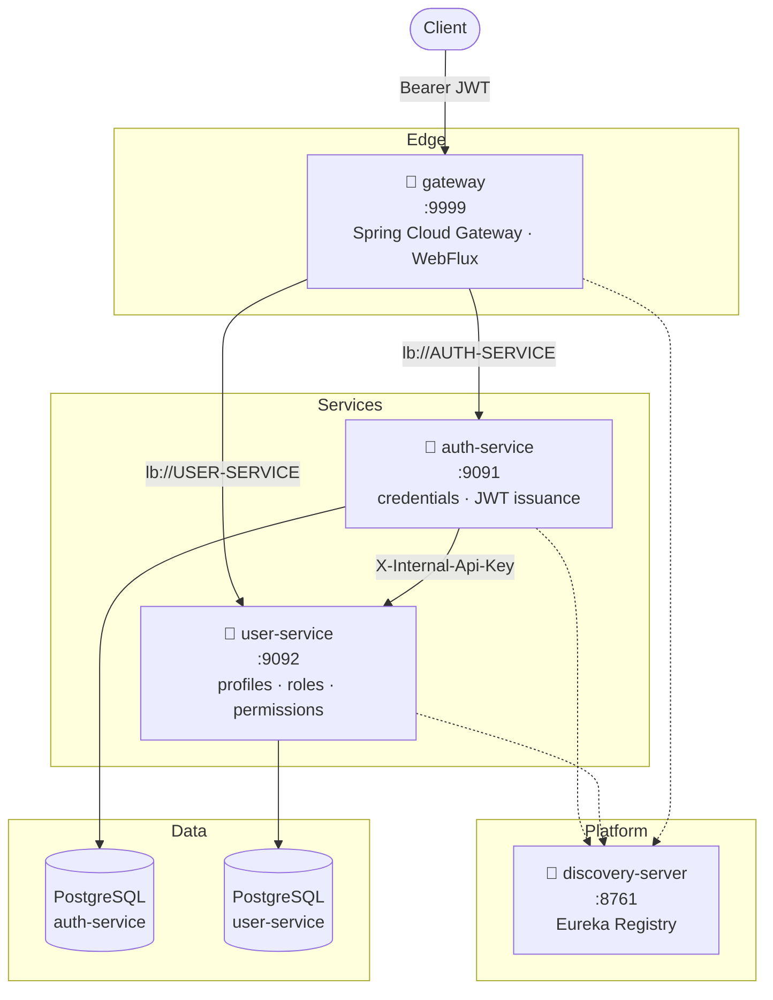
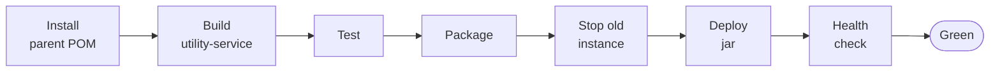

# 🛒 Enterprise E-Commerce Microservices


> A distributed e-commerce backend built with **Java 21**, **Spring Boot 4**, and **Spring Cloud** —
> engineered the way backend systems are built in professional teams: modular services, a reusable
> security starter, versioned database migrations, and a documented Git workflow.

**🚧 Actively under development.** Built sprint by sprint, with code review and refactoring between
each. This README describes what is **actually running today** — planned work is marked as such.

---

## 🏗️ Architecture



**Database per service.** No shared tables, no cross-service foreign keys — services are linked by
identifier only, exactly as they would be if deployed independently.

**Defence in depth.** Tokens are validated twice: once at the gateway, once inside each service.
A request that reaches a service directly — bypassing the edge — is still fully protected.

---

## ✅ What's Implemented

### Authentication & Authorization

| Capability | Detail |
|---|---|
| **User registration** | Password confirmation, BCrypt hashing, profile provisioned in `user-service` |
| **Login** | `AuthenticationManager` + custom `UserDetailsService` backed by a cross-service lookup |
| **Access tokens** | HS256 JWT, 1 h TTL, carrying `roles` and `permissions` as claims |
| **Refresh tokens** | 7 d TTL, persisted and revocable — the stateful half of a stateless design |
| **Token rotation** | Refreshing revokes the presented token and issues a new one |
| **Session invalidation** | Logging in revokes all outstanding refresh tokens for that user |
| **Token-type separation** | A refresh token is rejected anywhere an access token is expected |
| **RBAC** | `users → roles → permissions` graph, flattened into authorities at request time |
| **Method-level security** | `@PreAuthorize("hasRole(...)")` / `hasAuthority(...)` |
| **Service-to-service auth** | Dedicated internal API guarded by a shared key, compared in constant time |

### Platform

| Capability | Detail |
|---|---|
| **Shared security starter** | Spring Boot **auto-configuration** — a new service adds one dependency and inherits JWT validation, with every bean `@ConditionalOnMissingBean` so it stays overridable |
| **API gateway** | Reactive edge filter: rejects bad tokens before they reach a backend, forwards the resolved account id downstream |
| **Service discovery** | Eureka registry; services resolved by logical name (`lb://USER-SERVICE`), not hard-coded hosts |
| **Error contract** | `ErrorCode` interface + per-service enums → stable machine-readable codes (`AUTH_101`, `SEC-002`) rather than free-text messages |
| **Response envelope** | Uniform `ApiResponse<T>` / `PageResponse<T>` across every endpoint |
| **Global exception handling** | `@RestControllerAdvice` maps any `BusinessException` to the right HTTP status automatically |
| **Database migrations** | Flyway-versioned SQL; Hibernate runs `ddl-auto=none` so the schema is owned by migrations alone |
| **Auditing** | `@CreatedBy` / `@LastModifiedBy` resolved from the security context, plus `@Version` optimistic locking on every table |
| **API documentation** | springdoc OpenAPI on both business services |
| **CI/CD** | One Jenkins pipeline per service, defined by a `Jenkinsfile` beside the code it builds — test → package → graceful restart → health gate |
| **Health-gated deploys** | Spring Boot Actuator `/actuator/health` is polled after every deploy; a service that never reports `UP` fails the build instead of quietly staying broken |

---

## 🔐 Security Model

Authentication is **stateless JWT**. `auth-service` is the only token issuer; every other service is
a verifier.

**Access token claims**

```json
{
  "sub": "1",
  "userAccountId": 42,
  "email": "jane@example.com",
  "roles": ["ADMIN"],
  "permissions": ["USER_READ", "USER_WRITE"],
  "tokenType": "ACCESS_TOKEN",
  "iat": 1753900000,
  "exp": 1753903600
}
```

Embedding roles and permissions means **authorization needs no network call** — any service decides
locally from the token alone.

**Refresh tokens deliberately omit them.** Authorization data is re-fetched from `user-service` on
every refresh, so a permission change takes effect within one access-token lifetime instead of
requiring re-login.

**Two credentials, two purposes**

| Channel | Credential | Used for |
|---|---|---|
| Client → service | `Authorization: Bearer <jwt>` | End-user requests |
| Service → service | `X-Internal-Api-Key` | The internal API, on its own filter chain that never touches JWT |

---

## 🚀 Quick Start

**Prerequisites** — JDK 21 · Maven 3.9+ · PostgreSQL 14+

### 1. Create the databases

Names contain a hyphen, so they must be quoted:

```bash
psql -U postgres -c 'CREATE DATABASE "auth-service"; CREATE DATABASE "user-service";'
```

Don't create tables — Flyway builds the schema on first startup.

### 2. Build

```bash
mvn -f ecommerce-parent/pom.xml clean install
```

`install` (not `package`) — the services resolve the shared starter from your local repository.
`discovery-server` builds separately: `mvn -f discovery-server/pom.xml clean package`

### 3. Run — order matters

| # | Service | Port | Why the order |
|---|---|---|---|
| 1 | `discovery-server` | 8761 | Everything else registers here |
| 2 | `user-service` | 9092 | `auth-service` calls it during login |
| 3 | `auth-service` | 9091 | |
| 4 | `gateway` | 9999 | Last, so routes resolve immediately |

```bash
mvn spring-boot:run
```

### 4. Try it

```bash
curl -X POST http://localhost:9091/api/v1/auth/register -H "Content-Type: application/json" -d '{"email":"jane@example.com","firstName":"Jane","lastName":"Doe","displayName":"Jane","mobile":"9876543210","password":"Password123","confirmPassword":"Password123","gender":"FEMALE","dateOfBirth":"1990-01-15"}'
```

```bash
curl -X POST http://localhost:9091/api/v1/auth/login -H "Content-Type: application/json" -d '{"email":"jane@example.com","password":"Password123"}'
```

```json
{
  "success": true,
  "message": "Login successful. Welcome back!",
  "data": { "id": 1, "token": "eyJhbGci...", "refreshToken": "eyJhbGci..." },
  "timestamp": "2026-08-01T10:15:30.123"
}
```

**Swagger UI** — http://localhost:9091/swagger-ui.html · http://localhost:9092/swagger-ui.html

---

## 📡 API

Direct ports shown; via the gateway, prefix with `/auth-service` or `/user-service`.

### auth-service · `:9091`

| Method | Endpoint | Auth | Description |
|---|---|---|---|
| `POST` | `/api/v1/auth/register` | Public | Create credentials + profile |
| `POST` | `/api/v1/auth/login` | Public | Issue access + refresh tokens |
| `POST` | `/api/v1/auth/refresh-token` | Public | Rotate refresh token, issue new pair |

### user-service · `:9092`

| Method | Endpoint | Auth | Description |
|---|---|---|---|
| `POST` | `/api/v1/user/register` | Internal | Create a user profile |
| `PUT` | `/api/v1/user/assign-role/{id}` | `ROLE_ADMIN` | Assign a role to a user |
| `POST` | `/api/v1/roles/add-role` | JWT | Create a role |
| `GET` | `/api/v1/roles/find-all-by-paginated` | JWT | Paginated roles — `page`, `size`, `sortBy`, `dir` |
| `GET` | `/api/v1/internal/{email}` | API key | Profile with roles + permissions |

**Error responses** carry a stable code:

```json
{
  "status": 401,
  "errorCode": "SEC-002",
  "message": "JWT token expired",
  "path": "/api/v1/roles/find-all-by-paginated",
  "timestamp": "2026-08-01T10:15:30.123"
}
```

---

## 🧰 Technology Stack

| Layer | Technology | Version |
|---|---|---|
| Language | Java | 21 |
| Framework | Spring Boot | 4.1.0 |
| Cloud | Spring Cloud | 2025.1.2 |
| Gateway | Spring Cloud Gateway (WebFlux) | — |
| Discovery | Netflix Eureka | — |
| Security | Spring Security + JJWT | 0.13.0 |
| Persistence | Spring Data JPA / Hibernate | — |
| Database | PostgreSQL | 14+ |
| Migrations | Flyway | 12.4.0 |
| Mapping | MapStruct | 1.6.3 |
| Docs | springdoc OpenAPI | 3.0.2 |
| Build | Maven (multi-module) | — |
| CI/CD | Jenkins — declarative pipeline per service | — |
| Health checks | Spring Boot Actuator | 4.1.0 |

---

## 📁 Project Structure

```
ecommerce-microservices/
├── ecommerce-parent/      Maven parent — dependency & plugin management
├── utility-service/       Shared library: security starter + common contracts
├── discovery-server/      Eureka registry                      :8761
├── gateway/               API gateway, reactive                :9999
├── auth-service/          Credentials, JWT issuance            :9091
├── user-service/          Profiles, roles, permissions         :9092
├── config-server/         Spring Cloud Config (scaffolded)     :8080
└── docs/                  Engineering documentation
```

> The Maven reactor lives in `ecommerce-parent/pom.xml` — there is no root `pom.xml`.

Each deployable service also carries its own `Jenkinsfile`, so its build and deployment live beside
the code they ship.

Every business service follows the same internal layout:

```
controller/  → service/ (interface) → service/impl/ → repositories/ → entity/
                                          ↕
                              dto/ ←→ mapper/ (MapStruct)
```

---

## 🔁 CI/CD — Jenkins

Every service builds, deploys, and verifies itself. There is **one pipeline per module**, each
defined by a `Jenkinsfile` committed next to the code it builds — so the deployment process is
versioned, reviewed, and diffed like any other source file.

| Pipeline | What it deploys | Port | Profile |
|---|---|---|---|
| `discovery-server` | Eureka registry | 8761 | `dev` |
| `config-server` | Spring Cloud Config | 8888 | `native` |
| `auth-service` | Credentials, JWT issuance | 9091 | `dev` |
| `user-service` | Profiles, roles, permissions | 9092 | `dev` |
| `gateway` | Reactive edge | 9999 | `dev` |

### Change one service, redeploy one service

A GitHub webhook notifies Jenkins on every push; `triggers { githubPush() }` is what subscribes a job
to it. Each job is then **scoped to its own module path**, so a commit that touches `auth-service`
rebuilds and redeploys `auth-service` alone — the other four instances keep serving traffic, never
restart, and never appear in the build history for that change.

Shared code is part of that scope. Three services also watch `utility-service` and
`ecommerce-parent`, because a change to the shared security starter or to dependency management
genuinely does affect what they ship:

| Job | Rebuilds when these paths change |
|---|---|
| `auth-service` | `auth-service/` · `utility-service/` · `ecommerce-parent/` |
| `user-service` | `user-service/` · `utility-service/` · `ecommerce-parent/` |
| `gateway` | `gateway/` · `utility-service/` · `ecommerce-parent/` |
| `discovery-server` | `discovery-server/` · `ecommerce-parent/` |
| `config-server` | `config-server/` |

That path filter is the job's *Included Regions* (Git plugin → **Additional Behaviours → Polling
ignores commits in certain paths**). Without it, one webhook would fan out into five simultaneous
redeploys of a system where four of them changed nothing.

### Pipeline stages



| Stage | What it does, and why it exists |
|---|---|
| **Install parent POM** | `mvn -N install` on `ecommerce-parent` — `-N` builds that POM only. The services resolve `utility-service` *from the local repository*, and reading its POM needs the parent there too, where `<relativePath>` no longer applies |
| **Build utility-service** | `install -DskipTests` — publishes the shared security starter so the service about to build can resolve it. Skipped by `discovery-server` and `config-server`, which don't depend on it |
| **Test** | `mvn clean test` — a failing test stops the pipeline before anything is deployed |
| **Package** | `mvn package -DskipTests`, reusing the tests that just ran |
| **Stop old instance** | `SIGTERM` first, so Spring Boot deregisters from Eureka and closes the DB pool cleanly; `SIGKILL` 15 s later for anything that ignored it, because a lingering process holds the port and the new instance cannot bind |
| **Deploy jar** | Starts the new jar under `JENKINS_NODE_COOKIE=dontKillMe`, which stops Jenkins from reaping the process when the build ends |
| **Health check** | Polls Actuator until the service reports `UP` — see below |

Each job also sets `disableConcurrentBuilds()` (two deploys of the same service must never race for
the same port) and `buildDiscarder` (keeps the last 15 builds).

### Deploys are gated on health, not on a sleep

The naive version of this — sleep 30 seconds, then check the process is alive — reports success for a
service that started, threw on a failed migration, and is answering nothing. **A live JVM is not a
working service.**

```groovy
sh 'curl -sf --retry 12 --retry-delay 5 --retry-connrefused http://localhost:$APP_PORT/actuator/health || { tail -n 100 /tmp/$MODULE.log; exit 1; }'
```

One command, covering every state a starting service passes through:

| While the service is… | Actuator answers | curl does |
|---|---|---|
| Still booting, port closed | connection refused | retries (`--retry-connrefused`) |
| Up, but a component is broken | `503` + `{"status":"DOWN"}` | retries — 503 is a transient error to curl |
| Ready | `200` + `{"status":"UP"}` | exits 0 — **stage passes** |
| Never ready | — | after 13 attempts over 60 s, `-f` exits non-zero, the last 100 log lines are printed, **build fails** |

Because Actuator's health aggregates its indicators, the gate is genuinely meaningful: for
`auth-service` and `user-service` it stays `DOWN` until Flyway has migrated and the PostgreSQL pool
is live; for `gateway` it reflects the Eureka client, so a gateway that cannot resolve `lb://` routes
never passes as healthy.

Only the health endpoint is exposed —
`management.endpoints.web.exposure.include=health` — and it is whitelisted in each service's
`SecurityConfig` so the pipeline can poll it without a JWT. No other actuator endpoint is reachable.

---

## 🎯 Engineering Practices

Rather than list principles, here is what they look like in this codebase:

**Reusable auto-configuration.** `utility-service` ships a
`META-INF/spring/…AutoConfiguration.imports` descriptor. A new service adds one dependency and gets
JWT validation, claim extraction, and the authentication entry point — no configuration. Every bean
is `@ConditionalOnMissingBean`, so a service can override one without forking the library.

**Error codes over error strings.** Exceptions carry an `ErrorCode` (code + message + HTTP status).
`GlobalExceptionHandler` maps any `BusinessException` to the correct response automatically, and
clients branch on a stable code rather than parsing prose.

**Shared route constants.** Endpoint paths live in one place and are consumed by both the
controllers that serve them and the HTTP-interface clients that call them — so a path change is a
compile error, not a 404 in production.

**Migrations own the schema.** `ddl-auto=none` everywhere. Hibernate never alters a table, so
entity/schema drift surfaces at startup instead of silently mutating a database.

**Documented defects.** [`docs/issues.md`](docs/issues.md) is a running, severity-ranked defect log
with file/line references and remediation notes — reviewed and updated each sprint.

**Enterprise Git workflow.**

```
main ← stage ← qa ← dev ← feature/*
```

| Branch | Purpose |
|---|---|
| `main` | Production-ready |
| `stage` | Pre-production |
| `qa` | Testing & QA |
| `dev` | Active development |
| `feature/*` | One branch per ticket, merged via PR after review |

---

## 🗺️ Roadmap

### Authentication — near complete

- [x] Shared security infrastructure & auto-configuration
- [x] User registration with BCrypt
- [x] Login with JWT issuance
- [x] Refresh token with rotation and revocation
- [x] Role-based access control
- [ ] Logout / token blacklist
- [ ] Email verification & password reset
- [ ] Asymmetric signing (RS256 + JWKS)

### Platform hardening — next

- [x] Jenkins CI/CD — one pipeline per service, triggered by module path
- [x] Actuator health gate on every deploy
- [ ] Integration tests with Testcontainers
- [ ] Externalized secrets + working Config Server
- [ ] Resilience4j: timeouts, circuit breakers, bulkheads
- [ ] API rate limiting at the gateway
- [ ] Docker Compose for local orchestration
- [ ] Blue/green or rolling deploys — the current pipeline has a short restart gap

### Business services

- [ ] Product · Category · Inventory
- [ ] Cart · Order · Payment
- [ ] Notification

### Scale & observability

- [ ] Kafka event streaming + transactional outbox
- [ ] Redis caching
- [ ] Distributed tracing (OpenTelemetry)
- [ ] Prometheus & Grafana
- [ ] Centralized logging (ELK)
- [ ] Kubernetes deployment on AWS

---

## 👨‍💻 Author

**Tarique Hayat** — Backend Engineer

Java · Spring Boot · Spring Cloud · Microservices · PostgreSQL · Spring Security · Software Architecture

> *Building enterprise-grade backend systems one sprint at a time.*
